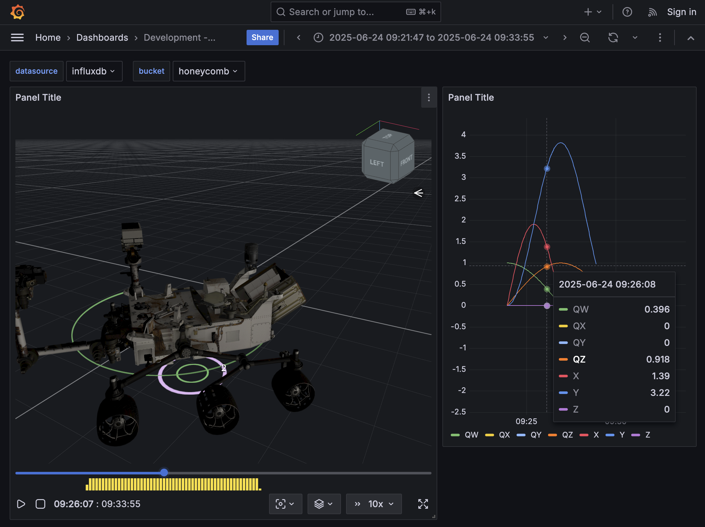
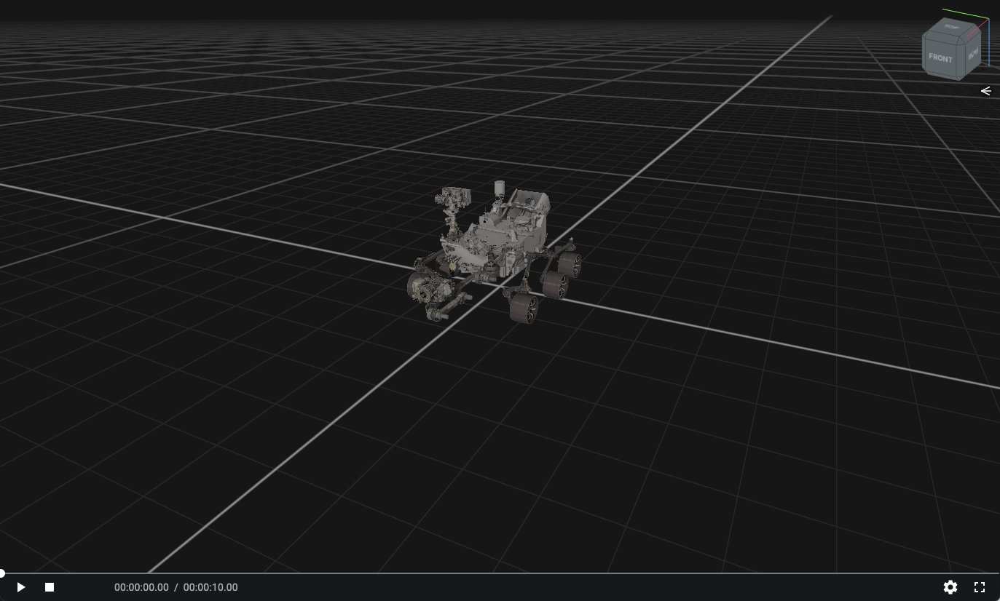

# Honeycomb

This repo demonstrates the Honeycomb suite of packages for robotic swarm and autonomy visualization. 

There are two separate apps that showcase how to utilize Honeycomb: 
1. A Grafana panel plugin that utilizes Grafana for the telemetry playback. This is the newer approach, which has been demonstrated for CADRE and M2020.
2. A "Caspian" standalone web app that utilizes Honeycomb's built-in telemetry playback code. This is the legacy approach, which has been used in flight operations by MSL, M2020, and EELS. It's also been tested for use by SRH and CADRE.

The current recommended approach is to use the Grafana Panel Plugin.

## Grafana Panel Plugin for Honeycomb panes



### Quick Setup
Tested with node v20.

Run the Grafana plugin:
```sh
$ cd app/grafrana
$ yarn install
$ yarn run dev
```

In a separate terminal, run Grafana and InfluxDB:
```sh
$ cd app/grafrana
$ docker compose build
$ docker compose up
```

Then visit http://localhost:3001/

### Changing the data

1. Login to InfluxDB at http://localhost:8087/ with `admin` and `admin123`
2. Delete the `honeycomb` bucket
3. Create a new `honeycomb` bucket
4. Add new data (e.g., via csv upload, such as using `app/grafana/.config/data/drive.csv`)
5. When reloading the dashboard in the Grafana view (http://localhost:3001/), update the start and end times appropriately. Alternatively, you could manually update the dashboard JSON files (e.g., `app/grafana/provisioning/dashboards/dashboard-log.json`).

## Caspian App

This is a self-contained web app that utilizes Honeycomb's config files and built-in telemetry loading, animating, and drivers.



### Quick Setup
Tested with node v20.

```sh
$ cd app/caspian
$ yarn install
$ yarn start
```

Then visit http://localhost:9000/browser/#/assets/configs/csv/test.json

### Changing the data
Adjust assets/configs/csv/test.json as necessary.

## Credit
Original design and development of Honeycomb was done by Garrett Johnson and Amos Byon, along with contributions from Katherine Park, Rob Ray, Flynn Platt, Amanda Chung, and Ryan Kinnett. 

## Copyright and License

Copyright (c) 2025 California Institute of Technology (“Caltech”). U.S. Government sponsorship acknowledged.

All rights reserved.

Redistribution and use in source and binary forms, with or without modification, are permitted provided that the following conditions are met:
- Redistributions of source code must retain the above copyright notice, this list of conditions and the following disclaimer.
- Redistributions in binary form must reproduce the above copyright notice, this list of conditions and the following disclaimer in the documentation and/or other materials provided with the distribution.
- Neither the name of Caltech nor its operating division, the Jet Propulsion Laboratory, nor the names of its contributors may be used to endorse or promote products derived from this software without specific prior written permission.

THIS SOFTWARE IS PROVIDED BY THE COPYRIGHT HOLDERS AND CONTRIBUTORS "AS IS" AND ANY EXPRESS OR IMPLIED WARRANTIES, INCLUDING, BUT NOT LIMITED TO, THE IMPLIED WARRANTIES OF MERCHANTABILITY AND FITNESS FOR A PARTICULAR PURPOSE ARE DISCLAIMED. IN NO EVENT SHALL THE COPYRIGHT OWNER OR CONTRIBUTORS BE LIABLE FOR ANY DIRECT, INDIRECT, INCIDENTAL, SPECIAL, EXEMPLARY, OR CONSEQUENTIAL DAMAGES (INCLUDING, BUT NOT LIMITED TO, PROCUREMENT OF SUBSTITUTE GOODS OR SERVICES; LOSS OF USE, DATA, OR PROFITS; OR BUSINESS INTERRUPTION) HOWEVER CAUSED AND ON ANY THEORY OF LIABILITY, WHETHER IN CONTRACT, STRICT LIABILITY, OR TORT (INCLUDING NEGLIGENCE OR OTHERWISE) ARISING IN ANY WAY OUT OF THE USE OF THIS SOFTWARE, EVEN IF ADVISED OF THE POSSIBILITY OF SUCH DAMAGE.

See [LICENSE](./LICENSE)
